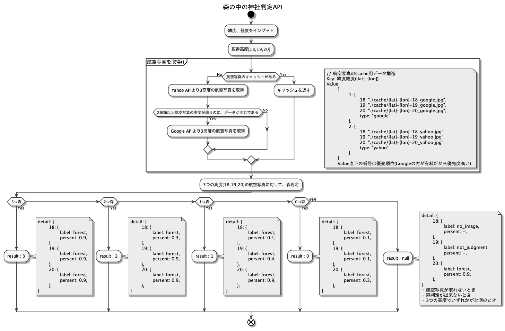

# search_jinja_in_the_forest

## やること
- ConohaVPSにデプロイ
- デプロイ手順をまとめる
- tensorflow処理後のキャッシュ処理追加
- 

## 判定実行
- python label_image.py --graph=output_graph.pb --labels=output_labels.txt --input_layer=Placeholder --output_layer=final_result --image=/root/img/not_forest/45-1859073_141-1391882_20.png

### 手軽に動作確認
- make exec
- cd src
- ./tf.bash

## コマンド
### コンテナ起動
- make run

### コンテナt停止
- make stop

### コンテナログイン
- make exec

### コンテナログ
- make log

### requirements.txtの生成
- pipenv lock -r

## 森判定のロジックイメージ

